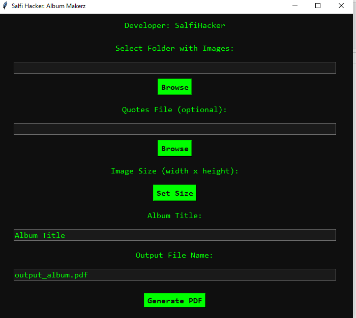

# Photo Album Generator - Standalone Executable

## Overview

The Photo Album Generator is a standalone Windows executable designed to convert a collection of images into a neatly formatted PDF album. This tool offers a user-friendly graphical interface to select images, specify image size, and include quotes in your album. 

Developed by: **Salfi Hacker**

## Features

- **Folder Selection**: Choose a folder containing your images.
- **Image Resizing**: Specify the dimensions of images for the final PDF.
- **Quotes**: Optionally include a `.txt` file with quotes to be included in the album.
- **Customizable Album Title**: Set a title for your photo album.
- **Output File Naming**: Define the name for the generated PDF file.
- **Progress Indicator**: Track the progress of PDF generation.

## Download

You can download the standalone executable from the [releases page](https://github.com/cyberfantics/photo-album/releases/tag/PhotoAlbum).

## Usage

1. **Run the Executable**: Double-click the `main.exe` file to launch the application.

2. **In the GUI**:
   - **Select Folder with Images**: Click "Browse" to choose the folder containing your images.
   - **Quotes File**: (Optional) Click "Browse" to select a `.txt` file with quotes.
   - **Set Image Size**: Enter the desired width and height for images.
   - **Album Title**: Enter the title for your album.
   - **Output File Name**: Specify the name for the resulting PDF file.
   - **Generate PDF**: Click "Generate PDF" to create your photo album.

3. **Progress**: The progress bar will show the status of the PDF generation.

## Screenshot

## Thank you for using the Photo Album Generator!
